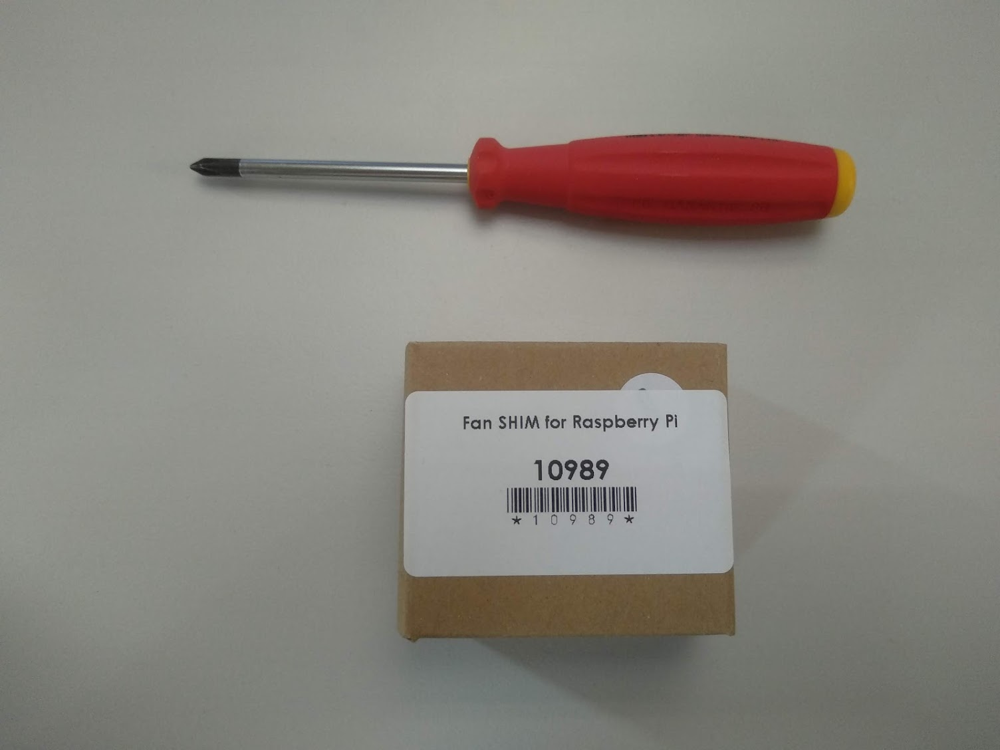
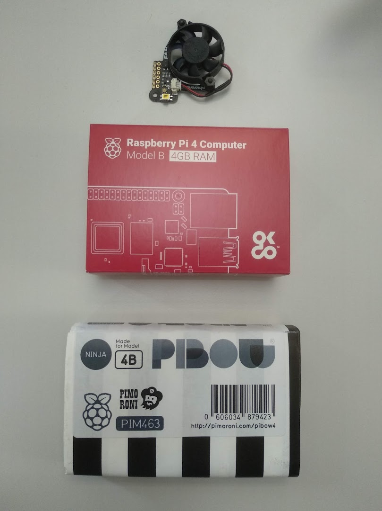
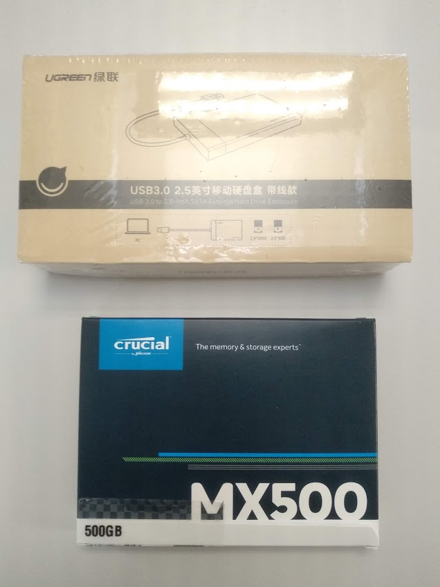
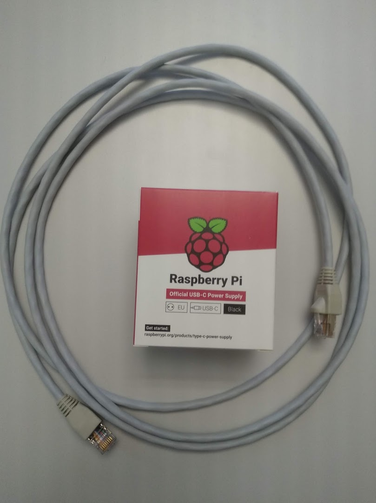
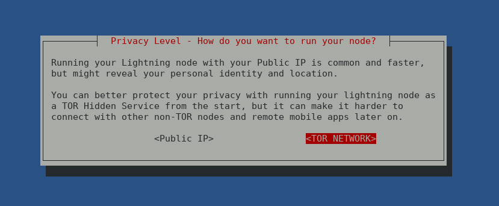
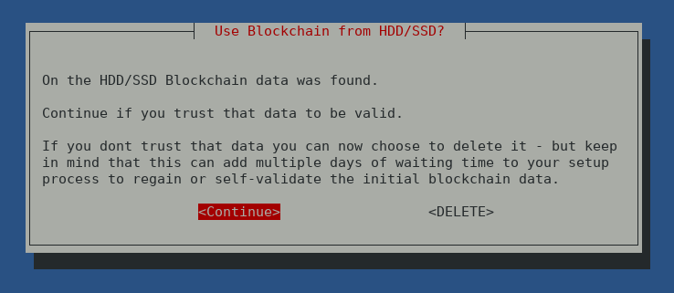

#HW zusammenbauen

### Ventilator zusammenbauen



https://learn.pimoroni.com/tutorial/sandyj/getting-started-with-fan-shim

* Eine Mutter bleibt übrig
* Ventilator noch nicht auf Raspi pappen
* Pi noch nicht ans Stromnetz anschliessen
* Stoppen beim Kapitel *Installing the Fan SHIM software*

### Raspi ins Case einfügen



https://www.youtube.com/watch?v=utk3cjzCLog

* Eine Mutter bleibt übrig
* Jedes Element hat eine Schutzfolie drauf, die entfernt werden soll

### SD Karte einführen


SD Karte mit Oberseite gegen unten in Raspi einführen.

Die SD Karten sind sind bereits mit einem Raspiblitz 1.3 geflasht.

### Festplatte in Gehäuse einbauen



Festplatte ins Gehäuse verbauen.

Gehäuse an einen der USB 3 Ports des Raspi hängen.

### Display anschliessen


Display anschliessen wie auf obigem Bild an Pins anschliessen.

Den Raspi mit 'Gummelis' auf der HD befestigen.

### Strom und Netz



Raspi per Ethernet an einem vorliegenden Switch anhängen.

DANACH den Raspi am Strom anschliessen.

Auf dem Display sollte nun ein blauer Screen mit der IP erscheinen:


# RaspiBlitz Installation

`ssh admin@[YOURIP]` → Passwort: `raspiblitz`


Danach weiter wie folgt:

https://github.com/rootzoll/raspiblitz#setup-process-detailed-documentation


# Zu beachten

### Tor



Verwende Tor für Deine Lightning Node. Dies hilft Dir nicht nur, Deine Privatsphäre zu schützen, sondern boxt sich auch durch Deine FireWall Zuhause durch, ohne dass Du Ports öffnen musst, oder eine statische IP brauchst.

### Verwende die vorhandene Blockchain!



Wir haben Euch die Blockchain bereits auf die HDD kopiert, da es Tage dauert sie zu syncen. Wählt hier _nicht_ "DELETE"!

### Einloggen per SSH Key

Passwörter sind böse. Sie sind mühsamer und unsicherer als Public Key Cryptography!

Während des Prozesses werdet Ihr aufgefordert werden, Euch auszuloggen und neu per ssh einzuloggen. Nutzt diese Möglichkeit gleich um was anderes zu tun!

Nämlich könnt ihr folgendes in euer lokals Terminal einfügen:

    ssh-copy-id admin@[Deine IP]
    
Somit könnt Ihr von Eurem Laptop künftig ohne Passwort auf den Raspi verbinden.
Zusätlich könnt Ihr gleich noch einen Eintrag in Eure SSH config machen (~/.ssh/config)

```bash
Host [DEIN_HOST]
    Hostname [DEINE_IP]
    User admin
```

Nun könnt Ihr euch folgendermassen einloggen:

    ssh [DEIN_HOST]
    
Zuhause müsst Ihr die IP in der Config dann natürlich anpassen.


